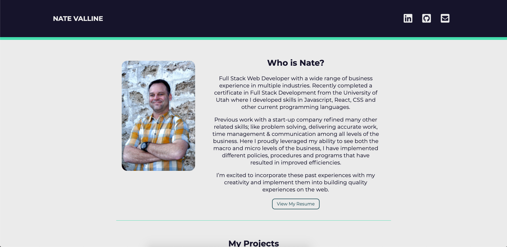
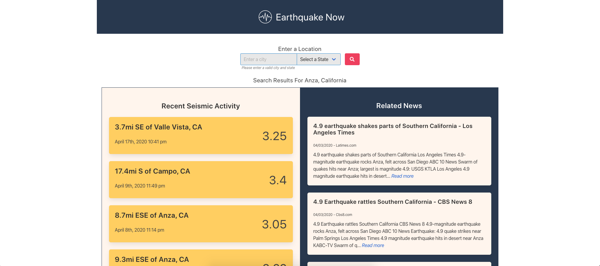

### Project Name

# My Portfolio



> This application is an updated portfolio displaying the most current information and projects.

#### [View The Site](https://nvalline.github.io/my-portfolio/)

---

### Table of Contents

Your section headers will be used to reference location of destination.

- [Description](#description)
- [How To Use](#how-to-use)
- [References](#references)
- [License](#license)
- [Contributors](#contributors)

---

## Description

This application was built to showcase my most up-to-date coding knowledge, professional information and projects that I have created.  

This application is fully responsive and utilizes some new tech that I have learned on top of the information that I have been learning in the coding bootcamp.

#### Technologies

- HTML 5
- SASS
- jQuery
- moment.js

---

## How To Use

Simply click the link below to view my portfolio.

[View The Site](https://nvalline.github.io/my-portfolio/)

#### Sample Code

```css
nav ul {
    display: flex;
    justify-content: space-evenly;
    align-items: center;
        
    li {
        list-style: none;

        a {
            text-decoration: none;
        }

        a i {
            padding: 0 .5em;
            font-size: 1.8em;
            color: $white-color;
        }

        a i:hover {
            color: $light-green-color;
        }
    }
    }
```

```html
<!-- Project Screenshot -->
                <div class="project-img">
                    
                </div>

                <!-- Project Content -->
                <div class="project-content">
                    <h3>Earthquake Now</h3>
                    <p class="project-description">This application allows the user to quickly find up-to-date seismic
                        data and related news articles for a specified location. This provides the user with valuable
                        information to make informed decisions.</p>
                </div>
```

```javascript
const copyrightYear = moment().format('YYYY');

$('#copyright').text(copyrightYear);
```

[Back To The Top](#project-name)

---

## References

- Nate Valline
- [SASS](https://sass-lang.com/)
- [W3Schools](https://w3schools.com)
- [MDN](https://developer.mozilla.org/en-US/)

[Back To The Top](#project-name)

---

## License

Copyright (c) 2020 Nate Valline

[Back To The Top](#project-name)

---

## Contributors

- Nate Valline

[Back To The Top](#project-name)

